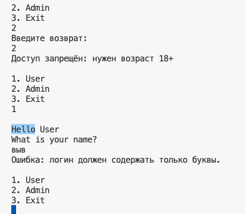

# 🛡 Go Auth System

Консольная система авторизации на Go с поддержкой ролей (Admin / User), валидацией имени, проверкой возраста и обработкой ошибок.

## 🚀 Возможности

- 👤 Вход как пользователь или администратор
- 🔐 Проверка логина и пароля
- 📏 Проверка возраста (18+)
- ✏️ Валидация имени: только буквы, с заглавной
- ❌ Обработка ошибок при вводе
- 🧪 Упражнения с `fmt.Scan`, `bufio`, `strconv`, `unicode`

## 🧪 Как запустить

```bash
go run main.go
```
или
```bash
go build
./go-auth-system
```

## 📂 Структура проекта

```
go-auth-system/
├── main.go         // точка входа
├── auth.go         // логика авторизации
├── go.mod          // описание модуля
└── README.md       // описание проекта
```

## 👨‍💻 Автор

**Kirill Lazebnik**  
🔗 [GitHub: kirillwolf](https://github.com/kirillwolf)



```
